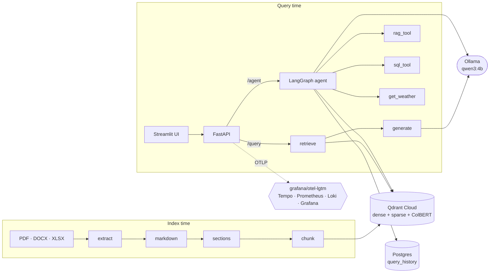

<h1 align="center">Enterprise RAG</h1>

<p align="center">
  A document question-answering system you can actually run, watch and measure.<br>
  <sub>PDF · DOCX · XLSX → hybrid retrieval → grounded, cited answers → tool-using agent</sub>
</p>

<p align="center">
  
  
  
  
  
  
  
</p>

---

Ask a question about your own documents and get an answer **with citations you
can check**. Everything runs on your machine except the vector store — no
answer-quality data leaves the box, because the model is local Ollama.

What makes this more than a demo:

| | |
|---|---|
| **Citations that survive the round trip** | Every chunk carries its heading chain and page numbers all the way into the answer |
| **Hybrid retrieval** | Dense + sparse (BM25) + ColBERT reranking, computed server-side by Qdrant |
| **An agent that routes** | Knowledge base, SQL over query history, or live weather — and it explains which it used |
| **Real observability** | Traces, metrics and logs into Grafana, correlated by `trace_id`, in one container |
| **Evaluation you can trust** | Retrieval metrics with **no LLM judge**, so they cost nothing and can't be rate limited |
| **Honest readiness** | `/ready` reports each dependency separately; Postgres going down doesn't take retrieval with it |

---

## How it fits together



---

## Quickstart

The fastest path is Docker. You need **Docker Desktop**, **Ollama**, and a free
**Qdrant Cloud** cluster.

**1. Get the model**

```bash
ollama pull qwen3:4b-instruct
```

**2. Configure**

```bash
cp .env.example .env
```

Fill in three things — the rest have working defaults:

| variable | where it comes from |
|---|---|
| `QDRANT_URL` | your cluster page at [cloud.qdrant.io](https://cloud.qdrant.io) |
| `QDRANT_API_KEY` | Qdrant → Data Access Control → API Keys (shown once) |
| `PG_PASSWORD` | your local Postgres — or set `API_ENABLE_AGENT=false` and skip it |

**3. Add your documents**

Drop PDFs, Word docs or spreadsheets straight into `data/raw/`. No subfolders —
they aren't scanned.

**4. Index them**

```bash
pip install -r requirements.txt
python scripts/run_index.py --dry-run     # parse + chunk only, no credentials needed
python scripts/run_index.py               # for real
```

Always start with `--dry-run`. It exercises extraction, heading detection and
chunking without touching the network, so a problem with your documents shows
up in seconds rather than after an upload.

**5. Run everything**

```bash
docker compose up -d --build
```

| what | where |
|---|---|
| Ask questions | <http://localhost:8501> |
| API docs | <http://localhost:8000/docs> |
| Dashboards | <http://localhost:3000> (admin / admin) |

Check it came up cleanly:

```bash
curl http://localhost:8000/ready
```

Every dependency reports separately, so a failure names what's broken instead
of erroring somewhere deeper. First check can take ~30s while Ollama loads.

> **No Docker?** `uvicorn api.main:app` and `streamlit run ui/app.py` work
> exactly the same. See [DOCKER.md](DOCKER.md) for the differences.

---

## Seeing what it's doing

One extra container gives you traces, metrics and logs, already wired together:

```bash
docker compose up -d lgtm    # included in the compose file
```

Open Grafana, find a slow request in the logs, click its `trace_id`, and see
exactly where the time went — Qdrant search vs. Ollama generation vs. waiting
for a generation slot.

**→ [OBSERVABILITY.md](OBSERVABILITY.md)** — what's collected, the queries
worth knowing, and the ready-made dashboard.

---

## Measuring whether it's any good

Two different questions, two different tools:

```bash
# Is retrieval finding the right chunks?  (no LLM judge — free, deterministic)
python mlflow/retrievalflow.py --label "baseline"

# Are the answers faithful and relevant?  (LLM judge)
python mlflow/ragflow.py

# Is the agent routing to the right tool?
python mlflow/agentflow.py --no-judge
```

The first one is the one to run every time you add documents — it costs
nothing, can't be rate limited, and moves only when retrieval actually changes.

**→ [mlflow/README.md](mlflow/README.md)** for the full evaluation story.

---

<details>
<summary><b>Running it without Docker</b></summary>

```bash
python -m venv venv && source venv/bin/activate    # Windows: venv\Scripts\activate
pip install -r requirements.txt
cp .env.example .env                               # then fill it in

python scripts/run_index.py                        # index your documents
python scripts/run_query.py "What is hybrid retrieval?"
python scripts/run_agent.py "How many queries have failed so far?" --show-tools

uvicorn api.main:app                               # http://localhost:8000
streamlit run ui/app.py                            # http://localhost:8501
```

To send telemetry from a local run, copy `api/.env.example` to `api/.env` and
start the backend with `docker compose up -d lgtm`.

Tests:

```bash
pytest                      # fast, no network needed
pytest -m integration       # the ones that need live services
```

</details>

<details>
<summary><b>The services behind it</b></summary>

**Qdrant — cloud, required.** The vector store. Free tier is plenty. Create a
cluster, copy the URL and an API key. You don't create the collection yourself;
`run_index.py` does that on first run.

Dense, sparse and ColBERT vectors are all computed **server-side**
(`cloud_inference=True`), which is why serving needs no local embedding model
and no GPU beyond what Ollama uses.

**Ollama — local, required.** The generator. `ollama pull qwen3:4b-instruct`,
then leave it running. Check with `curl http://localhost:11434/api/tags`.

**Postgres — local, optional.** Only `/agent` and query-history logging need
it. `CREATE DATABASE "RAG";` and the table is created automatically. Set
`API_ENABLE_AGENT=false` to skip it entirely — `/query` is unaffected.

</details>

<details>
<summary><b>Project layout</b></summary>

```
src/                 the library — pure functions and lazy factories
  config.py          Config + logger
  models.py          StructuralUnit, Chunk — shared dataclasses
  extraction.py      PDF / DOCX / XLSX → records
  markdown.py        heading detection → Markdown
  sections.py        Markdown → sections, with page numbers
  chunking.py        semantic + fixed chunking
  payload.py         build_payload / format_source
  vector_store.py    client, collection, dedup, upload
  retrieval.py       hybrid search + ColBERT rerank
  generation.py      prompt, LLM, retries, generate_answer
  history.py         Postgres query_history
  agent.py           tools + LangGraph graph

api/                 FastAPI service — routes, state, logging, telemetry
ui/                  Streamlit front end
scripts/             entry points — run_index, run_query, run_agent, run_api
mlflow/              evaluation flows: retrieval, answer quality, agent
evaluation/          golden datasets and standalone eval scripts
observability/       the Grafana dashboard
tests/               assertions, mostly network-free
data/raw/            put your source documents here
```

**The one rule:** each module only imports from ones above it in that list. If
you ever want to import upward, something is in the wrong file.

</details>

<details>
<summary><b>How citations actually work — and how they once broke</b></summary>

This is the part worth understanding, because it is where the pipeline broke
once and the failure was silent.

Section splitting records the heading chain each section sits under. Chunking
copies it onto every chunk. `payload.py` turns it into the Qdrant payload and,
at query time, back into a citation:

```
chunk.metadata          {"section_path": ["Foundation Models", "Pre-training"],
                         "page_start": 41, "page_end": 42, ...}
        ↓ build_payload
Qdrant payload          {"section_heading": "Foundation Models > Pre-training",
                         "page_label": "pp.41–42", ...}
        ↓ format_source
citation                [Foundation-LLMs.pdf — Foundation Models > Pre-training, pp.41–42]
```

**Qdrant only returns what the payload holds.** An earlier prototype's upload
step wrote five keys and dropped `metadata` entirely, so every citation came
back as `[Unknown section, p.?]` while the metadata sat intact one stage
upstream. `build_payload` and `format_source` now live together in one small
module with one test file, precisely so the write side and the read side can
never disagree again.

`run_index.py` prints "Chunks with no section heading: N/total" before
uploading anything. A non-zero N means heading detection missed, and that is
far cheaper to fix there than to discover in an answer.

</details>

<details>
<summary><b>Design decisions worth knowing</b></summary>

- **No module-level side effects.** `get_client()`, `get_llm()`,
  `get_connection()` and `build_agent()` are lazy singletons, so importing any
  module opens no connections and loads no models. That's what lets `pytest`
  run without Qdrant.
- **Sync handlers, never `async def`.** The whole pipeline is blocking; in an
  async handler one slow generation would stall every concurrent request
  including `/health`. FastAPI runs `def` handlers in a threadpool instead —
  which is why `api/state.py` exists to make the singletons thread-safe.
- **Two slots, on purpose.** One 4b model on a 6GB card doesn't go faster with
  ten concurrent requests, it thrashes. A semaphore caps generations and past
  the timeout returns a 503 you can act on rather than an invisible queue.
- **Readiness is per component.** Postgres going down 503s `/agent` while
  `/query` stays 200. A single boolean would pull a healthy retrieval endpoint
  out of a load balancer for a dependency it never touches.
- **The agent takes a fast path.** When the automatic knowledge-base search
  clearly matches the question, the answer comes straight from those documents
  — skipping a routing turn the model didn't need. `AGENT_RAG_FAST_PATH=0`
  disables it.
- **`num_ctx` is set explicitly** (default 16384). Ollama defaults it to 4096
  whatever the model supports, and `num_predict` comes out of that budget
  rather than on top of it.
- **`rag_tool` returns the answer plus citations, not the whole result dict.**
  In an agent loop every tool return is permanent context; returning the raw
  chunks would carry thousands of tokens through every later turn.

</details>

---

## Documentation

| | |
|---|---|
| [DOCKER.md](DOCKER.md) | Containers, troubleshooting, publishing images |
| [OBSERVABILITY.md](OBSERVABILITY.md) | Traces, metrics, logs and the dashboard |
| [mlflow/README.md](mlflow/README.md) | Evaluation — retrieval, answer quality, agent |
| [observability/README.md](observability/README.md) | The Grafana dashboard, and why there's so little config |
